# Lab 1: Azure DevOps Pipeline で Xamarin アプリケーションをビルドする

## 0. Lab 1 で習得できること

このハンズオンでは、以下のことを学ぶことができます。

1. Azure DevOps でチームプロジェクトを作成する方法
2. Azure Repos からコードをクローンする方法
3. Azure Repos にコードをプッシュする方法
4. Azure Pipelines で Pipeline を作成する方法
5. Azure Pipelines でアプリをビルドする方法

## 1. Azure DevOps でチームプロジェクトを作成する

### 1. Azure DevOps のサイトにアクセスします

### 2. Azure DevOps のサイトで、[Create Project] をクリックします

### 3. プロジェクト名などを入力します

|項目名|説明|例|
|----|----|----|
|Project name|チームプロジェクトの名前を入力します|XamarinDemo|
|Description|チームプロジェクトの説明を入力します|de:code ハンズオンサンプル|
|Visibility|チームプロジェクトを外部に公開するかどうかを指定します|Private を選択します|
|Version control|チームプロジェクトで利用する |Git を選択します|
|Work item process|プロセステンプレートを選択します|Agile を選択します|

### 4. しばらく待つと、チームプロジェクトが作成されます

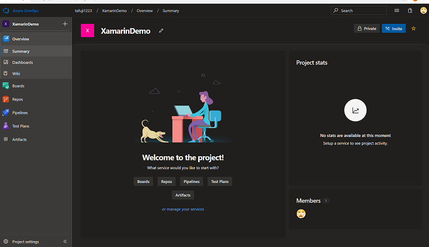

### まとめ

ここでは、Azure DevOps にチームプロジェクトを作成する手順を学びました。

## 2. Azure Repos からコードをクローンする

### 1. リポジトリのページに移動します

### 2. "add a .gitigonore:None" をクリックして、"Visual Studio" を選択し、"Initialize" ボタンを押します

### 3. リポジトリが初期化されたことを確認してください

### 4. "Clone" をクリックします

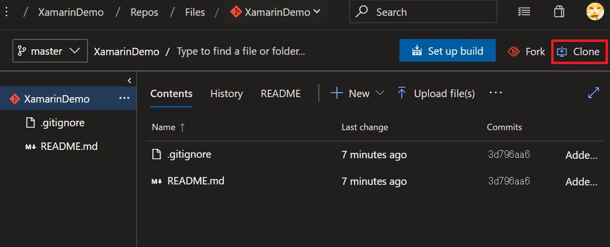

### 5. IDE の下にある "Clone in VS Code" の右側にあるボタンを押し、"Visual Studio" を選択します

### 6. Visual Studio を開きます

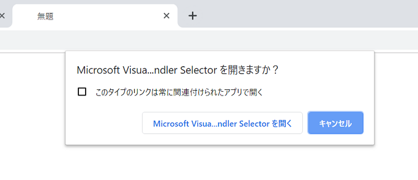

### 7. リポジトリをクローンするディレクトリを選択し、「複製」ボタンをクリックします

## 3. Azure Repos にコードをプッシュする

### 1. ソリューションを新規作成します

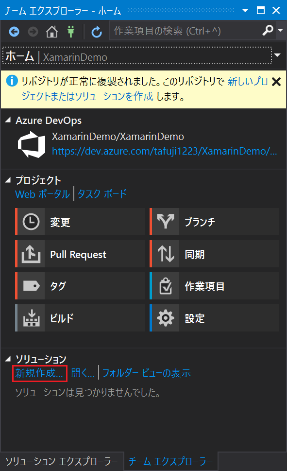

### 2. プロジェクトのフィルタリングを行います

### 3. Xamarin.Forms プロジェクトを選択します

### 4. プロジェクトの詳細を入力します

### 5. プロジェクトのテンプレートを選択します

|項目名|説明|
|----|----|
|テンプレートの選択|"マスター詳細" を選択します|
|プラットフォーム|"UWP" にチェックを入れる|
|モバイルバックエンド|チェックしない|

### 6. アプリケーションの動作確認を行います

   1. スタートアッププロジェクトの設定

        

   2. プロジェクトのデバッグ

        

   3. 動作確認

        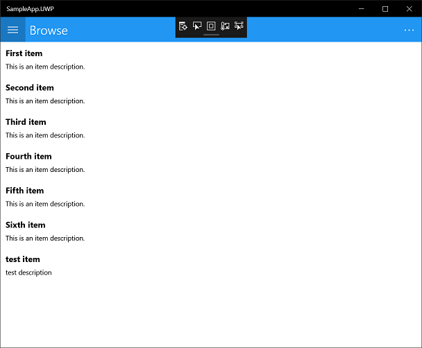

### 7. テスト用証明書の作成とインポート

1. パッケージマニフェスト（Package.appmanifest）ファイルを開いて、"パッケージ化" タブを選択し、"証明書の選択" ボタンを押します

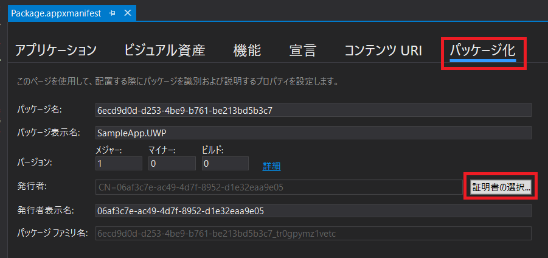

2. 証明書の選択で、"テスト証明書" を選択します

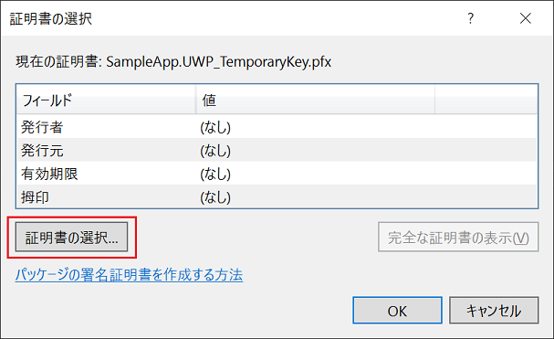

3. "OK" ボタンを押します

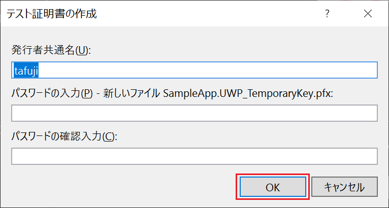

4. テスト証明書をソース管理に追加します。作成された pfx ファイルを右クリックし、"無視されたファイルをソース管理に追加" を選択します

5. テスト証明書をローカルマシンにインストールします。作成したテスト証明書をエクスプローラー上でダブルクリックします

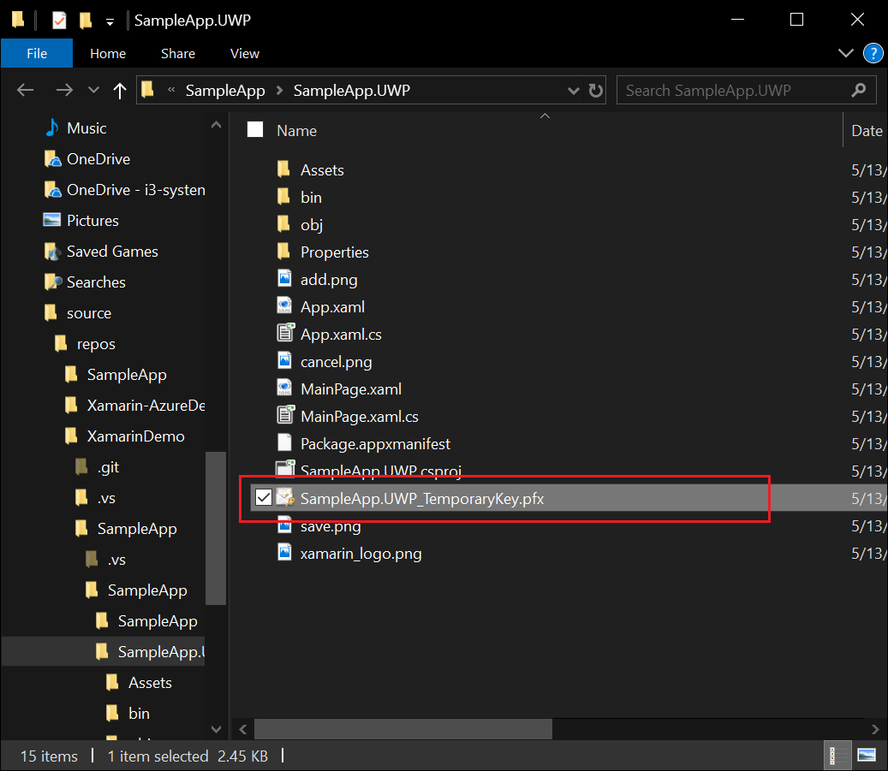

6. ローカルマシンの信頼されたルート証明機関に証明書をインポートします

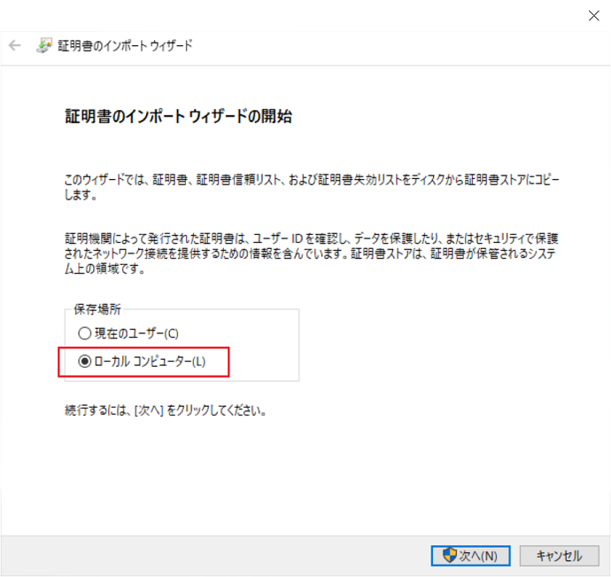

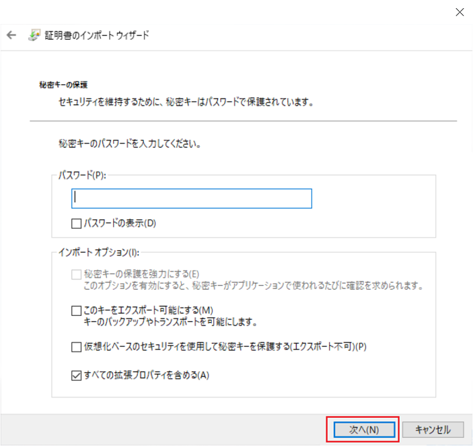

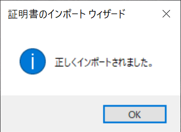

### 8. コードをリポジトリへ Push する

1. チームエクスプローラー上で、"変更" を選択します

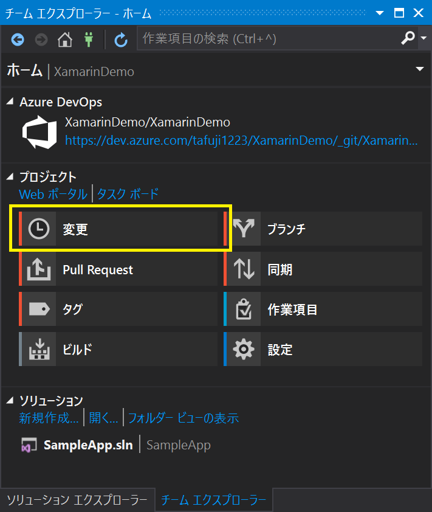

2. ソースコードなどすべての成果物が、"ステージング済みの変更" に移動していることを確認し、"コメント" を入力して、"ステージング済みをコミット" ボタンを押します

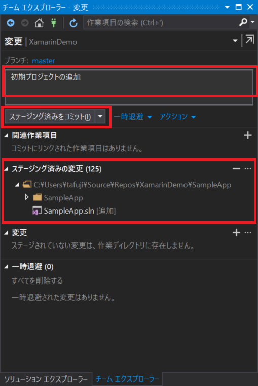

3. ローカルでのコミットが完了したら、"同期" のリンクをクリックします

4. 同期画面が表示されるので、"同期" のリンクをクリックします

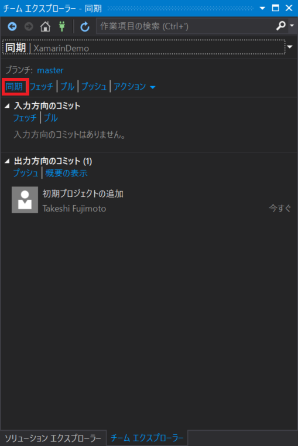

5. Azure DevOps 上にコードが Push されます

## 4. Azure Pipelines で Pipeline を作成する

### 1. 新しいパイプラインの作成

### 2. New Pipeline をクリックします

### 3. "Use Classic Editor" をクリック

### 4. リポジトリを選択して、"Continue" ボタンをクリックします

|項目名|説明|値|
|----|----|----|
|Select a source|ソースコードのリポジトリの種類を選択します|ここでは、"Azure Repos Git" を選択します|
|Team project|pipeline を作成するチームプロジェクトを選択します|作成したチームプロジェクトを選択します（ハンズオンの例では、"XamarinDemo" を選択します）|
|Repository|ソースコードのリポジトリ名を選択します|ハンズオンの例では、"XamarinDemo" を選択します|
|Default branch for manual and scheduled builds|Pipeline でビルドを行う既定のブランチを選択します|master|

### 5. ビルド定義のテンプレートで、"Universal Windows Platform" を選択し、"Apply" ボタンを押します

### 6. ビルド定義が作成されることを確認し、ビルド定義を保存します

ビルド定義が作成されたことを確認して、"Save & Queue" のタブをクリックして、"Save" をクリックします。

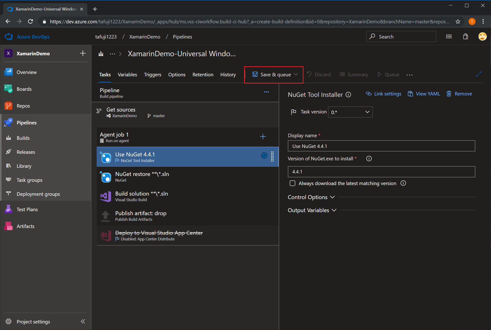

### 7. ビルド定義の保存

コメントを入力し、"Save" ボタンを押します。

## 5. Azure Pipelines でアプリをビルドする

### 1. ビルドパイプラインで "Queue" ボタンをクリックします

### 2. 設定値はそのままで、"Queue" ボタンをクリックします

### 3. ビルドが開始されたことを確認します

ビルドが開始されると、ビルド番号のリンクが表示されます。そのリンクをクリックします。

リンクをクリックすると、ビルド中のタスク状況が表示されます。

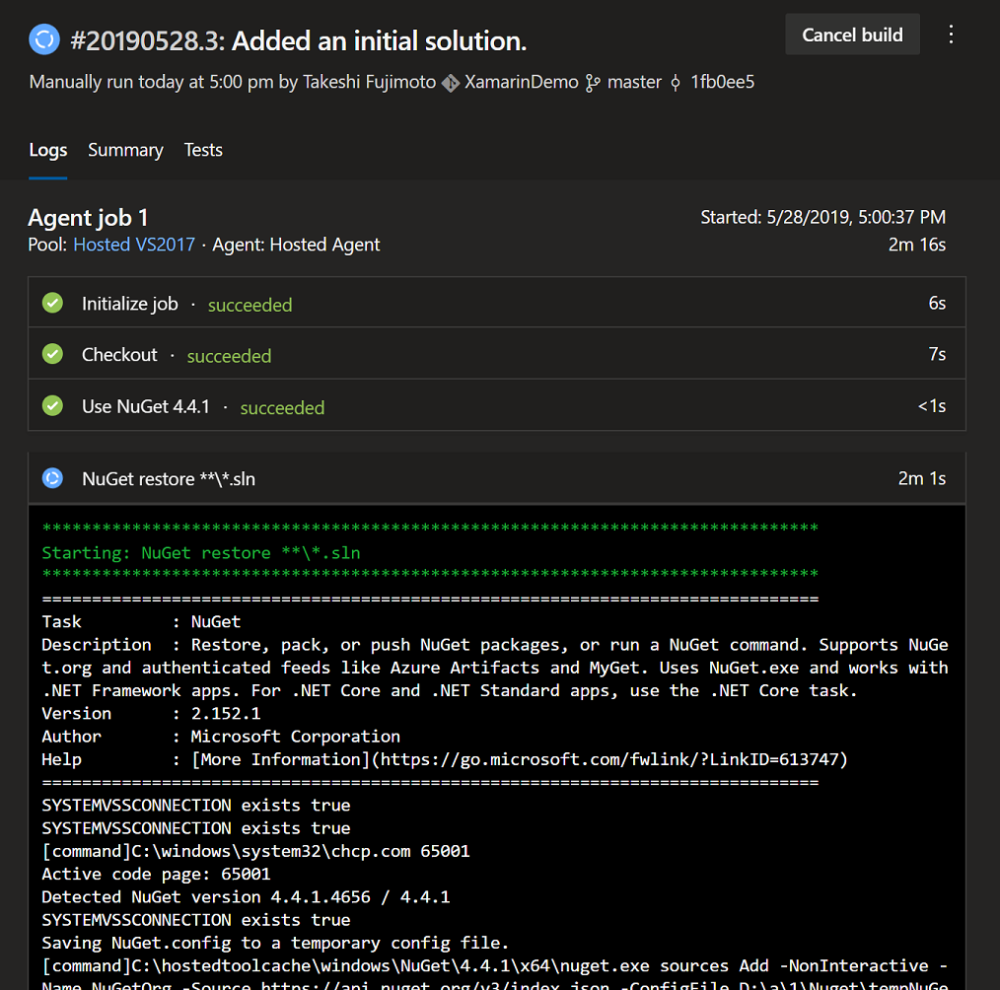

### 4. Azure Pipeline 上でビルドが成功することを確認してください

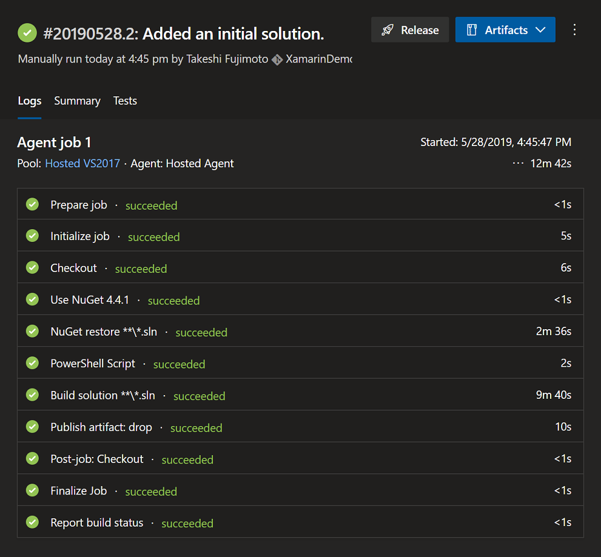

以上で、ハンズオンの Lab 1 は終了です。
