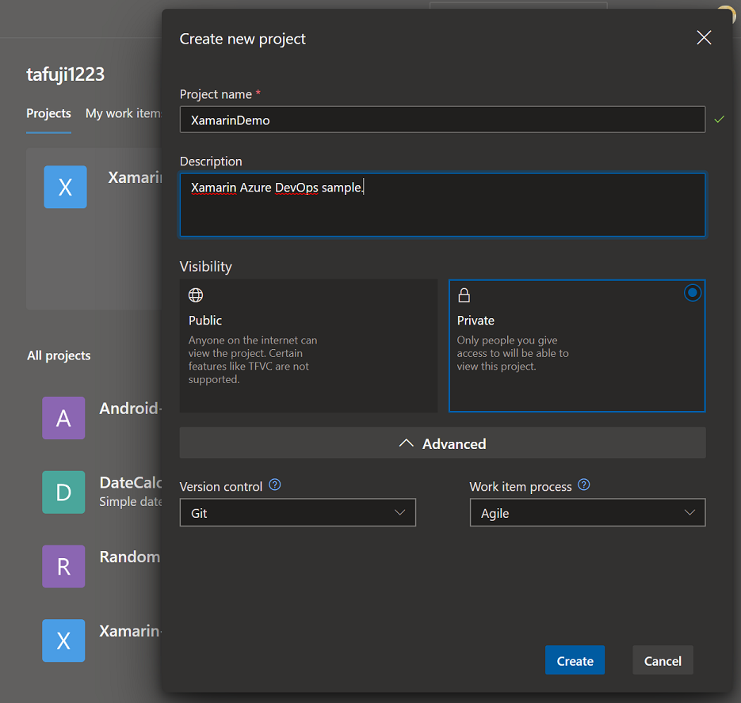
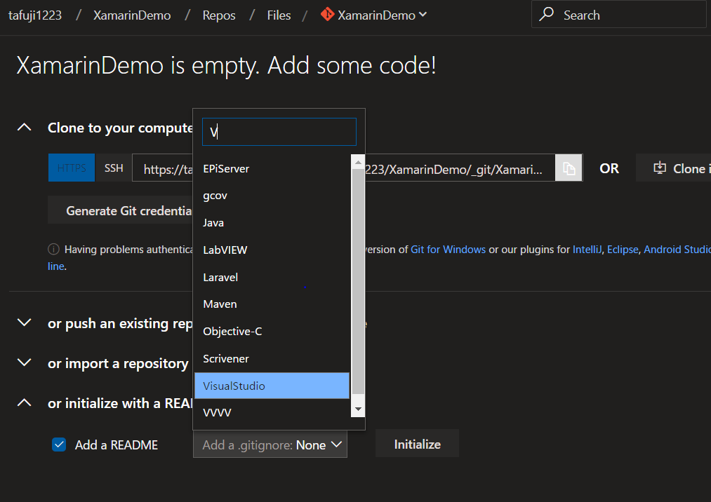
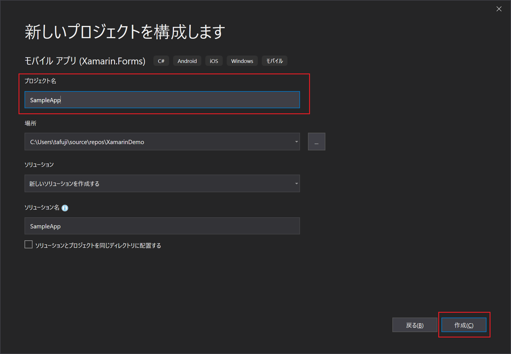
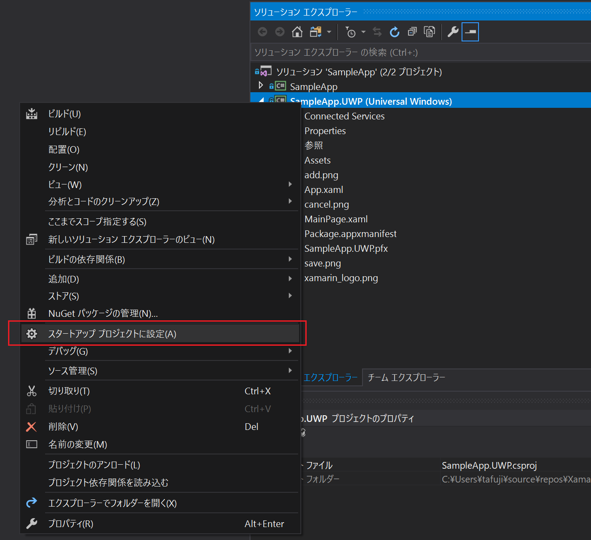
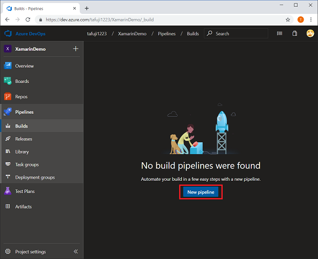
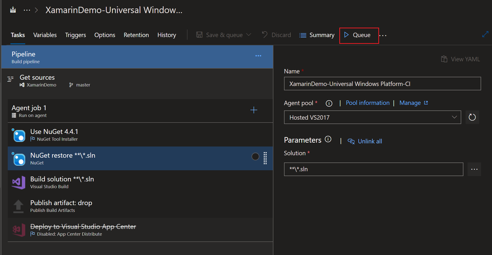

# Lab 1: Azure DevOps Pipeline で Xamarin アプリケーションをビルドする

## ここで学習すること

ここでは、以下のことを学習します。

- Azure DevOps の Pipeline を利用して、Xamarin アプリケーションのビルドを行う

## 1. Azure DevOps でチームプロジェクトを作成する

1. Azure DevOps のサイトにアクセスします

2. Azure DevOps のサイトで、[Create Project] をクリックします

    

3. プロジェクト名などを入力します

    

    |項目名|説明|例|
    |----|----|----|
    |Project name|チームプロジェクトの名前を入力します|XamarinDemo|
    |Description|チームプロジェクトの説明を入力します|de:code ハンズオンサンプル|
    |Visibility|チームプロジェクトを外部に公開するかどうかを指定します|Private を選択します|
    |Version control|チームプロジェクトで利用する |Git を選択します|
    |Work item process|プロセステンプレートを選択します|Agile を選択します|

4. しばらく待つと、チームプロジェクトが作成されます

    

## 2. リポジトリにソースコードを Push する

ここでは、Azure DevOps 上に作成したチームプロジェクトのリポジトリにアプリケーションのコードを Push します。

1. リポジトリをクローンします
   1. リポジトリのページに移動します

   2. "add a .gitigonore:None" をクリックして、"Visual Studio" を選択し、"Initialize" ボタンを押します。

     

   3. リポジトリが初期化されたことを確認してください

     

   4. "Clone" をクリックします

        

   5. IDE の下にある "Clone in VS Code" の右側にあるボタンを押し、"Visual Studio" を選択します

        

   6. Visual Studio を開きます

        

   7. リポジトリをクローンするディレクトリを選択し、「複製」ボタンをクリックします

        

2. Xamarin アプリケーションを作成します

   1. ソリューションを新規作成します。

        

   2. プロジェクトのフィルタリング

        

   3. Xamarin.Forms プロジェクトを選択

        

   4. プロジェクトの詳細を入力

        

   5. プロジェクトのテンプレートを選択

        

3. アプリケーションの動作確認

   1. スタートアッププロジェクトの設定

        

   2. プロジェクトのデバッグ

        

   3. 動作確認

4. テスト用証明書の作成

5. コードをリポジトリへ Push する

## 3. Azure Pipelines で Build を作成する

1. 新しいパイプラインの作成
   1. New Pipeline をクリックします

        

   2. "Use Classic Editor" をクリック

        

2. リポジトリを選択

     

3. ビルド定義のテンプレートで、"Universal Windows Platform" を選択

     

4. ビルド定義の保存

     

## 4. Azure Pipeline でアプリケーションをビルドする

1. ビルドパイプラインで "Queue" ボタンをクリックします

     

2. 設定値はそのままで、"Queue" ボタンをクリックします

     

3. Azure Pipeline 上でビルドが成功することを確認してください

     

## まとめ

