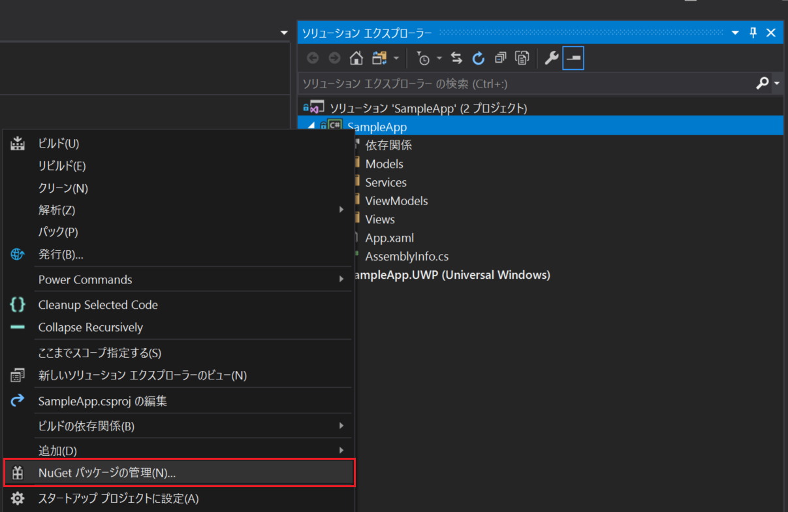

# Lab 3 Visual Studio App Center の SDK を利用したアプリの診断・解析

## ここで学習すること

ここでは、以下のことを学習します。

- App Center SDK を利用して、アプリケーションにモニタリングの機能を実装する
- App Center 上でアプリケーションのモニタリングを行う

## 1. App Center SDK を利用して、アプリケーションに Analytics, Diagnostic 機能を実装する

### 1. App Center SDK のパッケージをアプリケーションに追加する

1. ソリューションエクスプローラーで、Xamarin.Forms のプロジェクト（ハンズオンの例では、SampleApp プロジェクト）を右クリックし、"NuGet パッケージの管理" をクリックします



2. "参照" タブを選択し、テキストボックスで "AppCenter" と入力し、"Microsoft.AppCenter.Analytics" と "Microsoft.AppCenter.Crashes" をインストールします


### 2. 初期化コードを実装する

```App.xaml.cs``` に以下のコードを記述します。

- using ステートメントを追加します

    ```csharp
    using Microsoft.AppCenter;
    using Microsoft.AppCenter.Analytics;
    using Microsoft.AppCenter.Crashes;
    ```

- OnStart() メソッドに初期化コードを追加します
  
  ```csharp
  AppCenter.Start("uwp={Key}", typeof(Analytics), typeof(Crashes));
  ```

参考のために、以下にコード全体を示しておきます。

```csharp
using System;
using Xamarin.Forms;
using Xamarin.Forms.Xaml;
using SampleApp.Services;
using SampleApp.Views;

// 追加されたコード（ここから）
using Microsoft.AppCenter;
using Microsoft.AppCenter.Analytics;
using Microsoft.AppCenter.Crashes;
// 追加されたコード（ここまで）

namespace SampleApp
{
    public partial class App : Application
    {

        public App()
        {
            InitializeComponent();

            DependencyService.Register<MockDataStore>();
            MainPage = new MainPage();
        }

        protected override void OnStart()
        {
            // Handle when your app starts
            AppCenter.Start("uwp={Key}", typeof(Analytics), typeof(Crashes)); // 追加されたコード
        }

        protected override void OnSleep()
        {
            // Handle when your app sleeps
        }

        protected override void OnResume()
        {
            // Handle when your app resumes
        }
    }
}
```

### 3. Analytics のコードの追加とテスト用にアプリをクラッシュさせるコードを追加

#### 1. Analytics 用のコードの追加

ここでは、TODO のアイテムが保存さたときに、保存したアイテムの Text と Description をトラッキングするコードを記述します。
```NewItemPage.xaml.cs``` ファイルの ```Save_Clicked``` メソッドを編集します。

- using ステートメントの追加

    ```csharp
    using Microsoft.AppCenter.Analytics;
    ```  

- 変更前

    ```csharp
    async void Save_Clicked(object sender, EventArgs e)
    {
        Analytics.TrackEvent(
            $"{nameof(NewItemPage.Save_Clicked)}",
            new Dictionary<string, string>()
            {
                {$"{nameof(Item.Text)}", Item.Text },
                {$"{nameof(Item.Description)}", Item.Description }
            });

        MessagingCenter.Send(this, "AddItem", Item);
        await Navigation.PopModalAsync();
    }
    ```

- 変更後

    ```csharp
    async void Save_Clicked(object sender, EventArgs e)
    {
        // 追加されたコード（ここから）
        Analytics.TrackEvent(
            $"{nameof(NewItemPage.Save_Clicked)}",
            new Dictionary<string, string>()
            {
                {$"{nameof(Item.Text)}", Item.Text },
                {$"{nameof(Item.Description)}", Item.Description }
            });
        // 追加されたコード（ここまで）

        MessagingCenter.Send(this, "AddItem", Item);
        await Navigation.PopModalAsync();
    }
    ```

#### 2. アプリをクラッシュさせるテスト用のコードの追加

ここでは、簡単のために "About" ページを開いたときに、アプリケーションをクラッシュさせるコードを記述します。```AboutPage.xaml.cs``` ファイルを以下のように編集します。

```csharp
using Microsoft.AppCenter.Crashes; // 追加されたコード
using System;
using System.ComponentModel;

using Xamarin.Forms;
using Xamarin.Forms.Xaml;

namespace SampleApp.Views
{
    // Learn more about making custom code visible in the Xamarin.Forms previewer
    // by visiting https://aka.ms/xamarinforms-previewer
    [DesignTimeVisible(true)]
    public partial class AboutPage : ContentPage
    {
        public AboutPage()
        {
            InitializeComponent();
            Crashes.GenerateTestCrash(); // 追加されたコード
        }
    }
}
```

## 2. Azure DevOps にコードを Push し、ビルドを行う

コードの編集が終わったら、コードを Azure DevOps に Push し、Azure DevOps 上でビルドを行ってください。

## 2. App Center 上でアプリケーションのモニタリングを行う

App Center の Analytics を見ると、作成したアプリケーションのアクティブユーザー数などが確認できます。


また、トラッキングしたイベントデータも確認することができます。


以上で、Lab 3 は終了です。